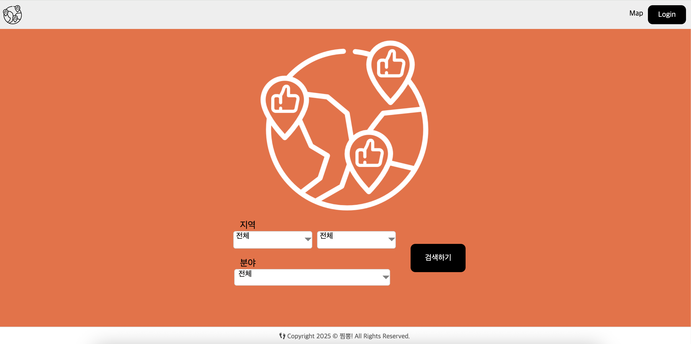

# 📌 JJimppong! - *여행 후기 커뮤니티*
<div align="center">
<h3>찜뽕 여행 후기 커뮤니티 서비스</h3>
</div>



<div align="center">
<h3><a href="http://13.124.81.10:3000/" target="_blank">배포 링크 - http://13.124.81.10:3000/</a></h3></div>


## 📖 프로젝트 개요
지역 주민들의 생생한 여행·지역 정보를 공유하는 커뮤니티 서비스.  
계정 등급 시스템으로 활발한 정보 갱신을 유도하고, 지도 API로 게시글과 지역 정보를 연동해 직관적인 정보 탐색 제공.

## ✨ 주요 기능
- 회원가입, 로그인
- 카카오, 네이버 로그인
- 여행 후기 게시글 작성, 수정, 삭제
- 여행 후기 좋아요, 싫어요, 조회수 조회
- 지도 페이지 지역별 축제, 팝업스토어, 맛집 리스트 정보 제공

## 🖥️ 기술 스택
- Java 22
- Spring Boot
- Spring Security
- JWT (JSON Web Token)
- Spring OAuth2 Client
- Spring Data JPA
- MySQL
- Swagger (Springdoc OpenAPI)
- Lombok
- Gradle
- Naver Maps API
- AWS EC2
- CORS


## ✈️ 프로젝트 실행 방법
```bash
# 1. 클론 및 폴더 이동
git clone https://github.com/JJIMBBONG/jjimbbong-back.git
cd jjimbbong-back
```
```bash
# 2. 빌드
./gradlew build
```
```bash
# 3. 개발 서버 실행
./gradlew bootRun
```

## 📦 환경 변수 설정
```properties
# application.properties 파일
spring.datasource.driver-class-name=com.mysql.cj.jdbc.Driver
spring.datasource.url=jdbc:mysql://127.0.0.1:3306/jjimppong?serverTimezone=UTC&characterEncoding=UTF-8
spring.datasource.username=root
spring.datasource.password=root
jwt.secret=jwt_secret_key
```

## 🗂️ 폴더 구조
📂 jjimbbong-back  
├─ 📂 src/ # Spring Boot 소스 코드  
├─ 📂 gradle # Gradle 빌드 관련 파일들  
├─ 📃 build.gradle # Gradle 빌드 설정  
└─ 💻 gradlew # Gradle 실행 스크립트

## 📄 라이센스
### Copyright (c) <2025> jjimppong